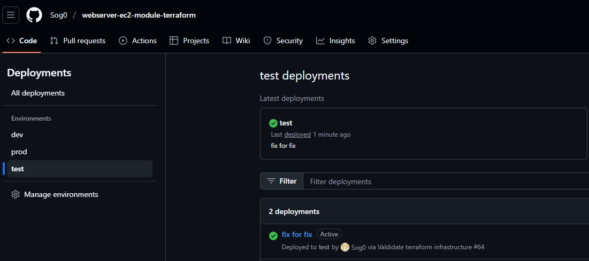

## 🌐 Creating a New Environment in GitHub

To add a new environment for your Terraform deployment, follow these steps:

1. **Go to Repository Settings**  
   Navigate to your GitHub repository. Click on **Settings** → **Environments**.

2. **Create a New Environment**  
   Click **"New environment"** and enter the name of the environment you need (e.g., `staging`, `production`, `test`).  
   Configure the required **protection rules**, **secrets**, and **environment variables** for this environment.

3. **Update the Workflow File**  
   Open the `flow.yaml` (or the corresponding GitHub Actions workflow file), and add the environment name to:
   - the `workflow_dispatch` input options (`options:` block)

4. **Push Your Changes**  
   Commit and push the updated workflow file to your repository.  
   Then go to the **Actions** tab, select the workflow, click **"Run workflow"**, and choose the desired environment from the dropdown menu.

5. **RESULT**  
